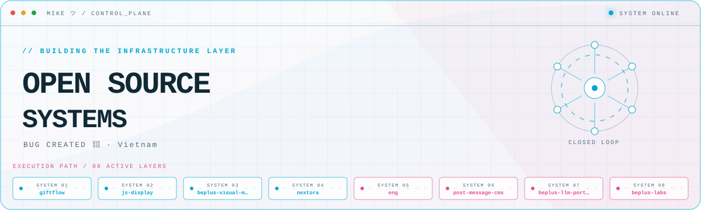
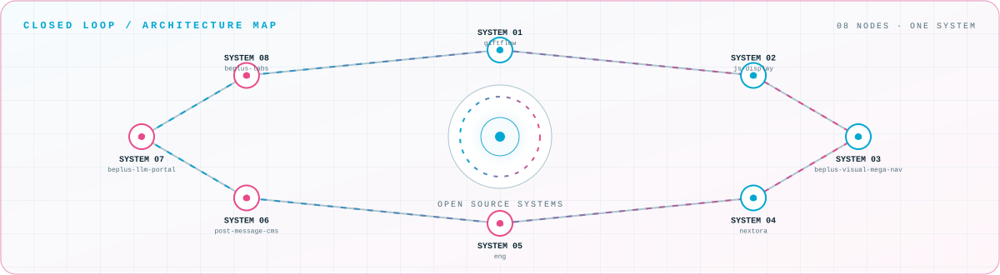

<picture>
  <source media="(prefers-color-scheme: dark)" srcset="assets/hero-dark.svg">
  <source media="(prefers-color-scheme: light)" srcset="assets/hero-light.svg">
  
</picture>

 

Bug created 🐞

## Flagship systems

| Repository | Role | Purpose |
| --- | --- | --- |
| [`giftflow`](https://github.com/miketropi/giftflow)  | PROJECT 01 | GiftFlow is a powerful WordPress plugin designed to help organizations manage donations, donors, and fundraising campaigns efficiently\. |
| [`js-display`](https://github.com/miketropi/js-display)  | PROJECT 02 | Chrome Extension Show All Javascript & Css include your site |
| [`beplus-visual-mega-nav`](https://github.com/miketropi/beplus-visual-mega-nav)  | PROJECT 03 | A WordPress plugin that adds a Gutenberg-powered mega menu builder to the native Appearance → Menus screen\. |
| [`nextora`](https://github.com/miketropi/nextora)  | PROJECT 04 | WordPress block theme — classic PHP templates, theme\.json, block template parts, Tailwind CSS v4\. |
| [`eng`](https://github.com/miketropi/eng)  | PROJECT 05 | — |
| [`post-message-cms`](https://github.com/miketropi/post-message-cms)  | PROJECT 06 | HTTP API and admin UI to \*\*forward messages into chat apps\*\*: Slack, Discord, Telegram, MS Team & more\. |

## Closed-loop architecture

<picture>
  <source media="(prefers-color-scheme: dark)" srcset="assets/closed-loop-dark.svg">
  <source media="(prefers-color-scheme: light)" srcset="assets/closed-loop-light.svg">
  
</picture>

## Module registry

<strong>JavaScript</strong> · 30 modules

| Module | Purpose |
| --- | --- |
| [`js-display`](https://github.com/miketropi/js-display) | Chrome Extension Show All Javascript & Css include your site |
| [`beplus-visual-mega-nav`](https://github.com/miketropi/beplus-visual-mega-nav) | A WordPress plugin that adds a Gutenberg-powered mega menu builder to the native Appearance → Menus screen\. |
| [`product-builder-app`](https://github.com/miketropi/product-builder-app) | — |
| [`product-builder-app--extensions-dev`](https://github.com/miketropi/product-builder-app--extensions-dev) | — |
| [`memberfun-web`](https://github.com/miketropi/memberfun-web) | — |
| [`giftflow-home`](https://github.com/miketropi/giftflow-home) | — |
| [`wp-update-hub`](https://github.com/miketropi/wp-update-hub) | — |
| [`mcp-read-localfile`](https://github.com/miketropi/mcp-read-localfile) | — |
| [`node-webhook-proxy`](https://github.com/miketropi/node-webhook-proxy) | — |
| [`ai-stack`](https://github.com/miketropi/ai-stack) | — |
| [`worry-proof-backup`](https://github.com/miketropi/worry-proof-backup) | WordPress plugin to backup, restore, import, and export your entire site |
| [`casket-edit`](https://github.com/miketropi/casket-edit) | — |
| [`agency-wp-cli`](https://github.com/miketropi/agency-wp-cli) | — |
| [`worry-proof-backup-home`](https://github.com/miketropi/worry-proof-backup-home) | — |
| [`wpb-upload-cli`](https://github.com/miketropi/wpb-upload-cli) | — |
| [`quiz`](https://github.com/miketropi/quiz) | — |
| [`authDemo`](https://github.com/miketropi/authDemo) | — |
| [`analysis-compare`](https://github.com/miketropi/analysis-compare) | — |
| [`cryptoApi`](https://github.com/miketropi/cryptoApi) | — |
| [`circular-diagram`](https://github.com/miketropi/circular-diagram) | — |
| [`botly`](https://github.com/miketropi/botly) | — |
| [`botly-doc`](https://github.com/miketropi/botly-doc) | — |
| [`devfun-blog`](https://github.com/miketropi/devfun-blog) | — |
| [`elementor-template-library`](https://github.com/miketropi/elementor-template-library) | — |
| [`browser-agent`](https://github.com/miketropi/browser-agent) | — |
| [`themeforest-agent`](https://github.com/miketropi/themeforest-agent) | — |
| [`cozyday`](https://github.com/miketropi/cozyday) | — |
| [`quizzz-nexjs`](https://github.com/miketropi/quizzz-nexjs) | — |
| [`elevator-simulator`](https://github.com/miketropi/elevator-simulator) | — |
| [`quizzz`](https://github.com/miketropi/quizzz) | — |

<strong>TypeScript</strong> · 15 modules

| Module | Purpose |
| --- | --- |
| [`nextora`](https://github.com/miketropi/nextora) | WordPress block theme — classic PHP templates, theme\.json, block template parts, Tailwind CSS v4\. |
| [`post-message-cms`](https://github.com/miketropi/post-message-cms) | HTTP API and admin UI to \*\*forward messages into chat apps\*\*: Slack, Discord, Telegram, MS Team & more\. |
| [`beplus-llm-portal`](https://github.com/miketropi/beplus-llm-portal) | — |
| [`beplus-labs`](https://github.com/miketropi/beplus-labs) | BePlus Labs — Open-source WordPress themes, plugins, and tools engineered with modern workflows (TypeScript, Tailwind CSS v4, PHPStan)\. Every product is MIT-licensed, rigorously tested, and built for the block editor\. |
| [`github-agent-runtime`](https://github.com/miketropi/github-agent-runtime) | — |
| [`buzzy`](https://github.com/miketropi/buzzy) | Embeddable comments, reviews, and ratings for the web\. |
| [`shopify-demo-app`](https://github.com/miketropi/shopify-demo-app) | — |
| [`stripe-recurring-demo`](https://github.com/miketropi/stripe-recurring-demo) | — |
| [`wpb-dummy-pack-center`](https://github.com/miketropi/wpb-dummy-pack-center) | — |
| [`l2w`](https://github.com/miketropi/l2w) | — |
| [`volumeTracker`](https://github.com/miketropi/volumeTracker) | — |
| [`utenzo-shopify-doc`](https://github.com/miketropi/utenzo-shopify-doc) | — |
| [`image-template-io`](https://github.com/miketropi/image-template-io) | — |
| [`alone-landing`](https://github.com/miketropi/alone-landing) | — |
| [`devfun`](https://github.com/miketropi/devfun) | — |

<strong>PHP</strong> · 10 modules

| Module | Purpose |
| --- | --- |
| [`giftflow`](https://github.com/miketropi/giftflow) | GiftFlow is a powerful WordPress plugin designed to help organizations manage donations, donors, and fundraising campaigns efficiently\. |
| [`prompt-to-pattern`](https://github.com/miketropi/prompt-to-pattern) | — |
| [`content-guard`](https://github.com/miketropi/content-guard) | Protect your WordPress content and show a customizable ad popup when copy or right-click is attempted\. |
| [`memberfun-api`](https://github.com/miketropi/memberfun-api) | — |
| [`optstack`](https://github.com/miketropi/optstack) | — |
| [`wp-plugin-template`](https://github.com/miketropi/wp-plugin-template) | — |
| [`wp-headless`](https://github.com/miketropi/wp-headless) | — |
| [`memberfun-docker`](https://github.com/miketropi/memberfun-docker) | — |
| [`casket-design-backend`](https://github.com/miketropi/casket-design-backend) | — |
| [`buymyweedonline-helpers`](https://github.com/miketropi/buymyweedonline-helpers) | — |

<strong>Other</strong> · 5 modules

| Module | Purpose |
| --- | --- |
| [`eng`](https://github.com/miketropi/eng) | — |
| [`docker-mysql-adminneo`](https://github.com/miketropi/docker-mysql-adminneo) | — |
| [`mysql-adminer-docker-compose`](https://github.com/miketropi/mysql-adminer-docker-compose) | — |
| [`Silence`](https://github.com/miketropi/Silence) | — |
| [`n8n-docker`](https://github.com/miketropi/n8n-docker) | — |

<strong>Dockerfile</strong> · 2 modules

| Module | Purpose |
| --- | --- |
| [`buildmat-app-api`](https://github.com/miketropi/buildmat-app-api) | — |
| [`getcockpit-with-flyio`](https://github.com/miketropi/getcockpit-with-flyio) | — |

<strong>MDX</strong> · 2 modules

| Module | Purpose |
| --- | --- |
| [`giftflow-doc`](https://github.com/miketropi/giftflow-doc) | — |
| [`optstack-doc`](https://github.com/miketropi/optstack-doc) | — |

<strong>HTML</strong> · 1 modules

| Module | Purpose |
| --- | --- |
| [`paypal-recurring-demo`](https://github.com/miketropi/paypal-recurring-demo) | — |

<strong>Liquid</strong> · 1 modules

| Module | Purpose |
| --- | --- |
| [`shopify-skeleton-theme`](https://github.com/miketropi/shopify-skeleton-theme) | — |

<a href="https://github.com/miketropi">GitHub</a> · <a href="https://devfun.blog">Website</a>

<!-- Generated by profile-control-plane. Edit profile.yaml, not this file. -->
